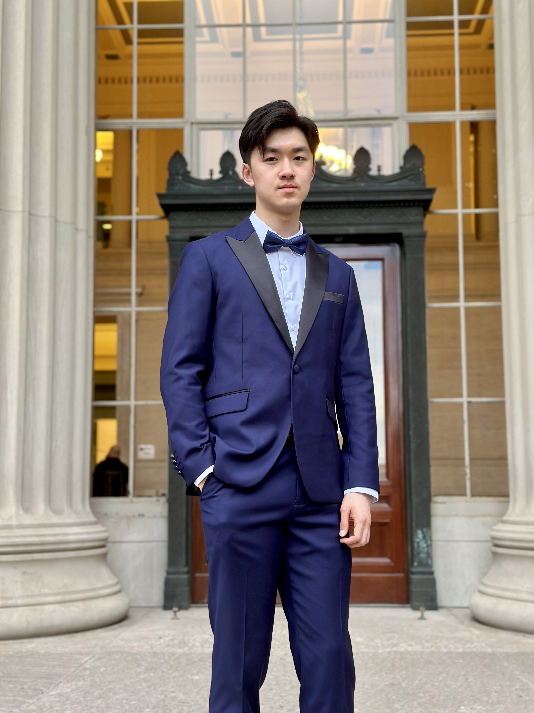

# About Me

  

Yo what's good everybody, my name is **Richard Lin**, and this is the greatest About Me page of all time.

Let's start at the beginning. It's a late Thursday afternoon on May 22nd, 2003. The sun was setting on the Town of North Hempsted in New York. In the North Shore University Hospital, a beautiful baby boy was born. He weighed 8 pounds, slightly above average. The boy will eventually find that he is above average in every thing he does.

...

Fast forward 21 years, and here I am, a student at the Massachusetts Institute of Technology, studying Computer Science. I'm a software developer, a designer, a writer, a musician, a photographer, a filmmaker, a philosopher, a mathematician, a physicist, a chemist, a biologist, a psychologist, a sociologist, a historian, a linguist, a geographer, a political scientist, an economist, a lawyer, a doctor, a teacher, a student, a friend, a son, a brother, a cousin, a nephew, a grandson, a boyfriend, a lover, a human being.

# My Interests

My one and only interest is in software design, so 6.1040 would be the perfect place for me to learn everything there is to know about desiging software that is elegant, powerful and flexible.

*Copilot provided inspiration for some parts of this About Me page.*

  <h1>FAQ</h1>
  <h2>Q: What are your strengths?</h2>
  
<em>A: Everything.</em>

  <h2>Q: What are your weaknesses?</h2>
  
<em>A: Nothing.</em>

<footer>
  
Questions? E-mail me at <a href="mailto:rwlny@mit.edu">rwlny@mit.edu</a>

</footer>