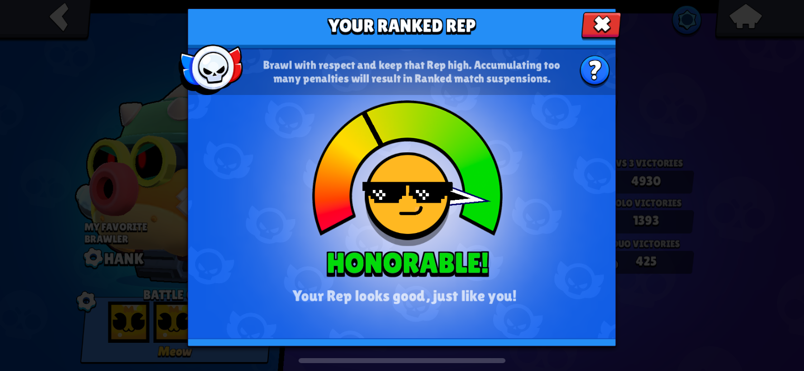

# Assignment 2 - Divergent Design

## Broad Application Goals

### App Name: Rely

### Intended Audience

Rely is made for people who use social media but might not be tech-savvy enough to accurately identify misinformation or fake content, especially when they are designed to look legitimate. 

### Value

Rely allows anyone, regardless of their tech-savviness or awareness of misinformation tactics, to easily verify the reliability of content they see on social media at just a glance. Rely is the next step in creating a social media experience that is reliable and trustworthy for everyone, especially in a world where misinformation and fake content are becoming increasingly prevalent and hard to identify.

## Scrapbook of Comparables

### Twitter Community Notes
{width="50%"}

This image decipts Twitter's community notes clarifying that the incident in the video is scripted, allow users to better uderstand the context that they might not otherwise be aware of. While Twitter's community notes still requires manual effort from other users to add these notes, community notes are still a good way of allowing users to verify the credibility of a social media post. An automated version of Twitter notes could be promising, allowing all posts in Rely to have credibility notes attached to them.

### Downvotes (Stack Overflow or Reddit)

The Stack Overflow comment in the image has a negative score, indicating that more users have downvoted the comment than upvoted it, suggesting that this comment might not be widely viewed as helpful or effective. The upvote/downvote feature, also used by Reddit, allows users to easily identify whether a social media post is well received by the other users who have seen it. While this feature is subject to human biases, it has potential to be a good indicator of credibility, allowing posts in Rely to have a metric representing the general consensus of the post.

### Instagram Misinformation Warning

{width="50%"}

The Instagram post in the image has a false information warning, suggesting that verified third-party fact checkers have flagged the post as containing false information. Posts with this warning also are distributed less to other users' recommendation feeds. Such a feature could be useful in Rely to let users see when a post may be unreliable and also reduce the spread of misinformation by limiting the recommentation of such posts, although caution should be taken to ensure that the fact-checkers are reliable and unbiased.

### YouTube Topical Context

The image above shows YouTube's topical context feature, which is displayed under videos on topics prone to misinformation. The topical context feature displays background context on the topic of the video and is sourced from indepentent third-party partners. This feature similar to Twitter's community notes and Instagram's misinformation warning, showing context under potentially misleading content that is verified by credible sources. Rely could implement a similar feature that allows misleading posts to have additional context from credible sources attached to them.

### YouTube Live Chat Summary

{width="50%"}

The YouTube live stream in the image has a "Chat Summary", which uses experimental AI to summarize what the live stream's chat messages are talking about. The other features mentioned in the scrapbook all have the limitation of requiring manual input from other users or fact-checkers, but the chat summary feature is an automated way of getting the general opinion that people have on a particular piece of content. Something similar to YouTube's live chat summary feature could be implemented on all social media posts in Rely, with AI that automatically summarizes how reliable people in the comments think a particular post is.

### Brawl Stars Rep(utation) Meter

The Rep Meter in Brawl Stars is a feature that shows a particular user's "reputation", where a low reputation score indicates that the user is likely to be a troll or disrespectful in their recent ranked games. While the Rep Meter is not directly related to misinformation on social media, Rely could implement something similar to the Rep Meter, where each Rely user has a "reliability score" that is displayed on their profile or the posts that they upload, allowing other users to see how reliable the user is based on their past posts and interactions.

## Brainstorm of Feature Ideas

### 1. text

text

## VSD Analysis

### 1. text

**Observation**: text

**Design Response**: text

## Storyboarding and Sketching

### 1. text

