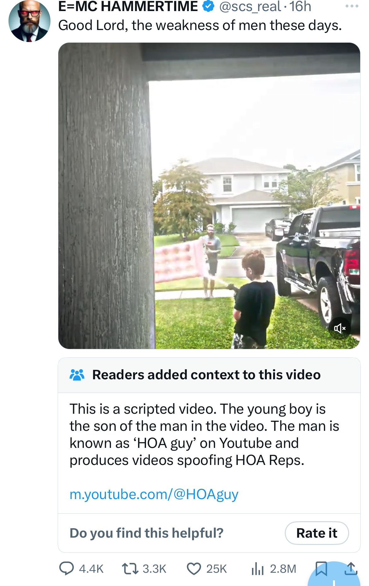
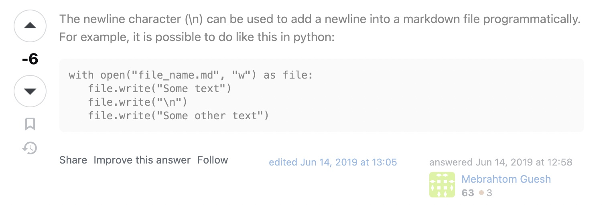
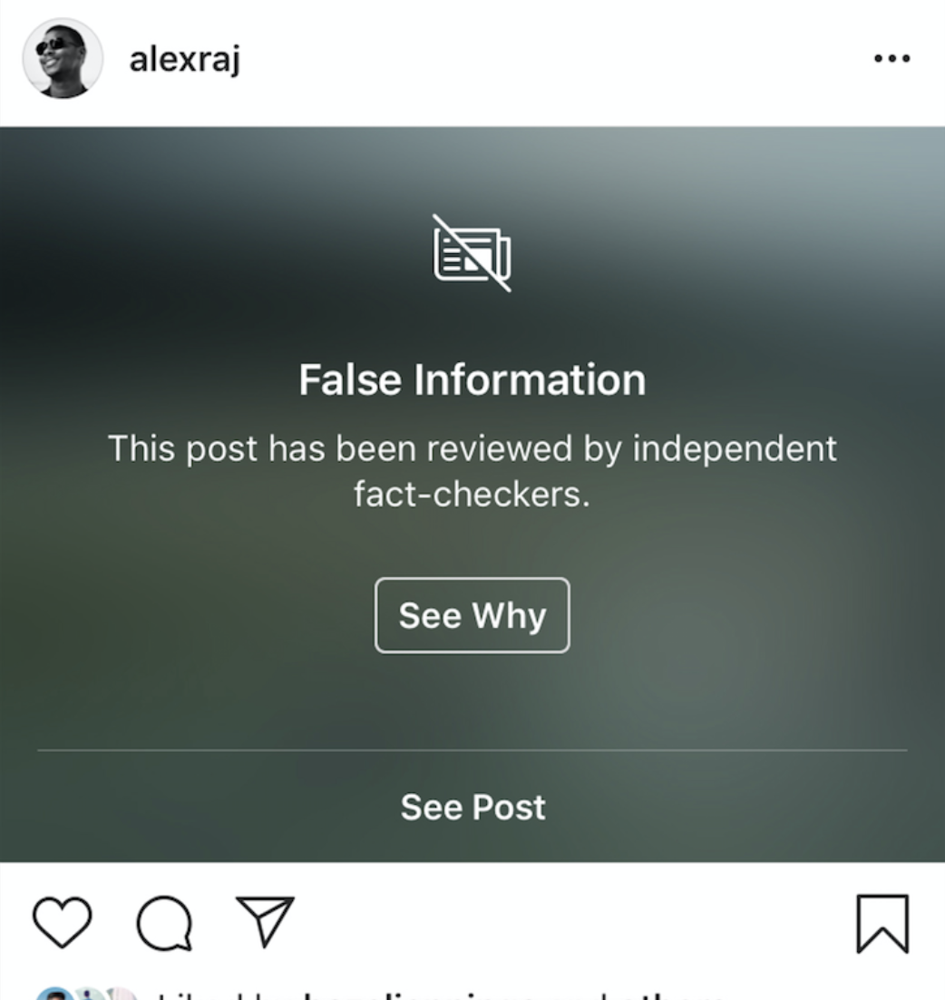
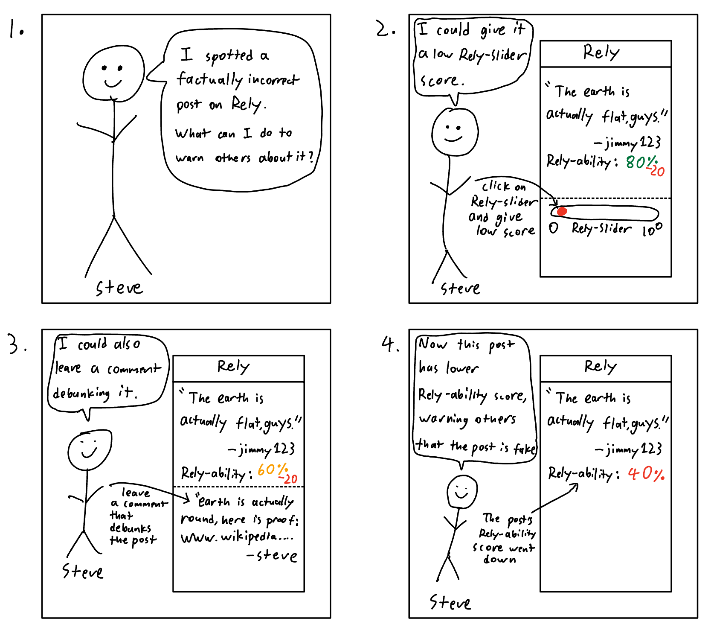
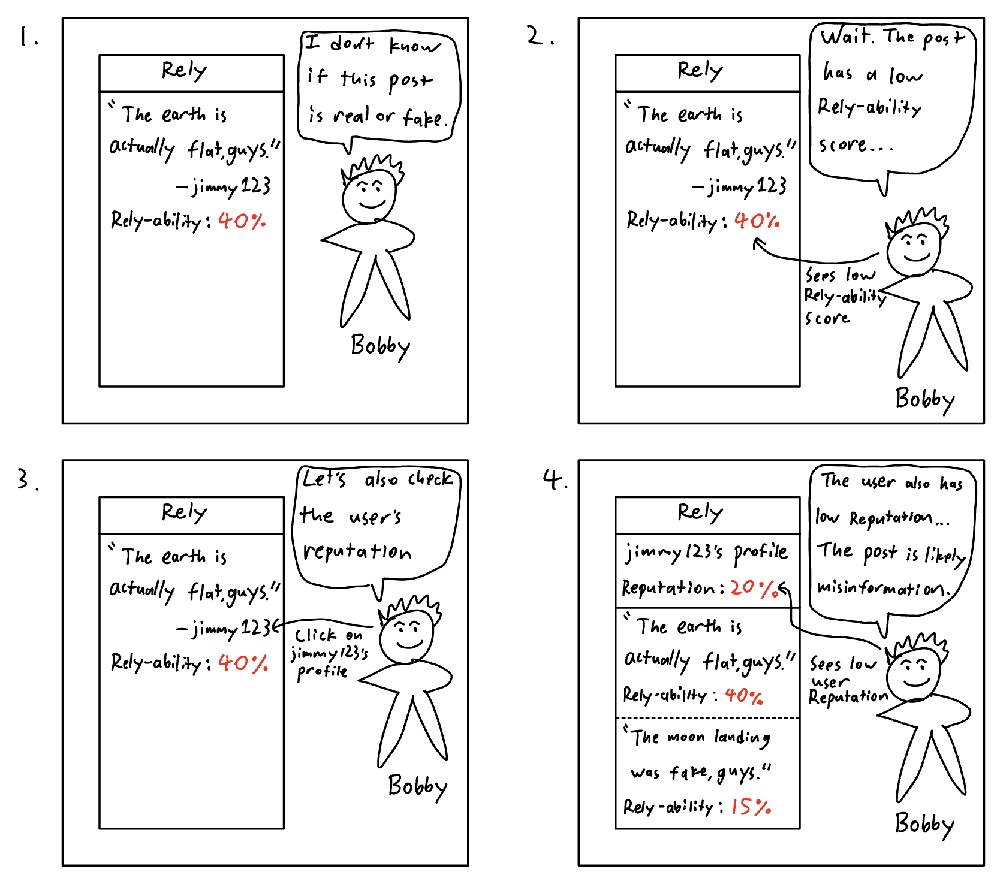

# Assignment 2 - Divergent Design

## Broad Application Goals

### App Name: Rely

### Intended Audience

Rely is made for people who use social media but might not be tech-savvy enough to accurately identify misinformation or fake content, especially when they are designed to look legitimate. 

### Value

Rely allows anyone, regardless of their tech-savviness or awareness of misinformation tactics, to easily verify the reliability of content they see on social media at just a glance. Rely is the next step in creating a social media experience that is reliable and trustworthy for everyone, especially in a world where misinformation and fake content are becoming increasingly prevalent and hard to identify.

## Scrapbook of Comparables

### Twitter Community Notes

This image shows Twitter's community notes clarifying that the incident in the video is scripted, allowing users to better uderstand the context that they might not otherwise be aware of. While Twitter's community notes still requires manual effort from other users to add these notes, community notes are still a good way of allowing users to verify the credibility of a social media post by better understanding the conext around it. An automated version of Twitter notes could be promising, allowing all posts in Rely to have credibility notes attached to them.

### Downvotes (Stack Overflow or Reddit)

The Stack Overflow comment in the image has a negative score, indicating that more users have downvoted the comment than upvoted it, suggesting that this comment might not be widely viewed as helpful or effective. The upvote/downvote feature, also used by Reddit, allows users to easily identify whether a social media post is well received by the other users who have seen it. While this feature is subject to human biases, it has potential to be a good indicator of credibility, allowing posts in Rely to have a metric representing the general consensus of the post.

### Instagram Misinformation Warning

The Instagram post in the image has a false information warning, suggesting that verified third-party fact checkers have flagged the post as containing false information. Posts with this warning also are distributed less to other users' recommendation feeds. Such a feature could be useful in Rely to let users see when a post may be unreliable and also reduce the spread of misinformation by limiting the recommentation of such posts, although caution should be taken to ensure that the fact-checkers are reliable and unbiased.

### YouTube Topical Context

The image above shows YouTube's topical context feature, which is displayed under videos on topics prone to misinformation. The topical context feature displays background context on the topic of the video and is sourced from indepentent third-party partners. This feature similar to Twitter's community notes and Instagram's misinformation warning, showing context under potentially misleading content that is verified by credible sources. Rely could implement a similar feature that allows misleading posts to have additional context from credible sources attached to them.

### YouTube Live Chat Summary

The YouTube live stream in the image has a "Chat Summary", which uses experimental AI to summarize what the live stream's chat messages are talking about. The other features mentioned in the scrapbook all have the limitation of requiring manual input from other users or fact-checkers, but the chat summary feature is an automated way of getting the general opinion that people have on a particular piece of content. Something similar to YouTube's live chat summary feature could be implemented on all social media posts in Rely, with AI that automatically summarizes how reliable people in the comments think a particular post is.

### Brawl Stars Rep(utation) Meter

The Rep Meter in the video game Brawl Stars is a feature that shows a particular player's "reputation", where a low reputation score indicates that the player is likely to be a troll or disrespectful in their recent ranked Brawl Stars games. In Brawl Stars, a player's reputation score decreases when they are reported by other players, and increases as they play more games without being reported. While the Rep Meter is not directly related to misinformation on social media, Rely could implement something similar to the Rep Meter, where each Rely user has a "reliability score" that is displayed on their profile or attached to the posts that they upload, allowing other users to see how reliable the user is based on their past activity and interactions.

### League of Legends Low Priority Queue

The image above depicts a player in the "low-priority queue" in the video game League of Legends. "Low-priority" players are players who frequently disconnect from games in the middle of battle or often intentionally disrupt the game in disrespectful ways. The low-priority queue limits the low-priority players to only play games with other low-priority players, which allows normal players to avoid playing with players who are frequently unreliable and disrespectful in their games. While once again not directly relating to reliability of social media content, Rely could implement some sort of low-reliability indicator, where users with a history of posting unreliable content are recommended less or placed in a seperate low-reliability feed, allowing other users more easily avoid content from unreliable sources.

## Brainstorm of Feature Ideas

### 1. Rely-ability Score

Each social media post in Rely could have their own automatically generated Rely-ability score. The Rely-ability score of a post could range from 0 to 100, with 0 meaning that the post is extremely unreliable, and 100 meaning that the post is extremely reliable. The Rely-ability score could be calcualted using AI sentiment analysis of the comments on the post to determine whether other users believe this post to be reliable or not. The Rely-ability score would be displayed on the post, allowing users to easily see how reliable the post is at a glance.

### 2. User Reputation

Each user in Rely would have a Reputaiton rating ranging from 0 to 100, with 0 meaning that the user is extremely unreliable, and 100 meaning that the user is extremely reliable. The Reputation rating would be calculated based the user's historical activity, accounting for the Rely-Ability score of all (or some) of their posts. If a user typically posts content with low Rely-ability scores, this would give other users a fair warning that the user is not reliable.

### 3. Rely-slider

Instead of liking or disliking a post, other users could rate a post with a slider that ranges from 0 to 100, where 0 to indicate reliability. The Rely-slider would allow users to give a more nuanced rating of a post instead of just a simple and vague like or dislike button. The scores from the Rely-slider could be taken into account when calculating the Rely-ability score of a post.

### 4. Reliability-focused Recommendation Algorithm

Typical social media recommendation algorithms prioritize metrics that would maximize users' time spent on the app. Rely, instead, would focus on posts that have high Rely-ability scores from users with high Reputation ratings. Rely's recommendation algorithms would still take total likes and engagement time into account, but simply has a higher emphasis on credibility and reliability of posts and users. This would allow more reliable content to become more viral, while the less-reliable content would be seen and distributed less.

### 5. Rely-ability Leaderboards

Rely could have a leaderboard that show the "most reliable" users on the platform as a fun way encourage reliability. The leaderboard would take into account both posting volume/frequency and the average Rely-ability score of a users' posts. Rely could contain both a global leaderboard of all users on the platform and local leaderboards of the most reliable users in a particular country or region. These leaderboards could be resetted monthly to encourage posting more reliable content.

### 6. Comment Section Relia-summary

For every Rely post, there could be a AI generated summary of what the comments are talking about, which could give better context to posts that are potentially misleading on top of the Rely-ability score. The comment section summary could also describe keywords that encapsulate the overall mood or tone of the comments, suggesting the overall opinions that users in the comments have torward the post.

### 7. AI Image Detection Warning

AI generated images are a more recent development that has the potential to create fake and misleading content to fool people who are not as good as identifying AI generated images. Each image posted in Rely would have a "AI Generated" tag/label on it if the image is determined to be generated by AI. This AI image detection system could be it's own AI/ML model, as well as manual flagging from other users.

### 8. Low & High Rely-ability Feeds

Posts would low rely-ability scores from users with low Reputation rating could enter a seperate "low-reliability" feed where they get less exposure, where the only way to getting out of the low-reliablity feed would be to consistency improve the quality and reliability of your posts, allowing them to regain priority in the feed. On the other hand, posts with high Rely-ability scores from users with high Reputation ratings could enter a "high-reliability" feed where they get more exposure, allowing users more to easily find reliable content. Users' profiles or posts could display whether they are in the low or high reliability feed. These feeds would contain the 10% least reliable and 10% most reliable posts/users respectively.

### 9. Misinformation-prone Topic Filters

Certain topics that are prone to misinformation, such as flat-earth and moon-landing theories, could be automatially labelled as "misinformation-prone". Users could opt to filter out certain misinformation-prone topics from their feeds. For example, if the user is tired of seeing posts about flat-earth theories, they could filter out all posts of that topic to clean up their feed and avoid unreliable content.

### 10. Sentiment Sorting of Comment Sections

The comments on a Rely post could be sorted by their sentiment or general opinion on the post, where the user can sort to see the comments that most heavily praise the post or the comments that most heavily criticize the post. The comments' sentiment would be determined by AI sentiment analysis, and the sorting would allow users to easily see specific opinons or viewpoints on the post.

### 11. Mood-based Feeds

Users could choose to view a feed of posts with a specific mood or tone, such as "positive", "negative", "neutral", "funny", "serious", etc. The mood-based feeds would be determined by AI sentiment analysis of the post and it's comment section, allowing users to easily find posts that match their current mood or tone.

### 12. Fact-Checked Badge

Rely posts that have scientifically-backed sources from reliable research journals or credible news outlets could have a "fact-checked" badge on them. The fact-checked badge could be automatically added to posts that have sources linked in the post itself, if the linked source is a widely-known credible source. The fact-checked badge could also be manually added by third-party fact-checkers.

### 14. Debunk Button

Each Rely post could have a "debunk" button that allows users to easily report a post as being misleading or false. The debunk button has the option for the user to include creidble sources or evidence against the information in the post, which would increase the validity of the debunk report. The debunk button would be used to flag posts that are potentially misleading or false, and would be taken into account when calculating the Rely-ability score of a post. This allows dedicated users to better warn against unreliable posts on top of simply giving them a low Rely-slider score or posting a comment.

### 15. Personal Rely-ability Tips

Each Rely user could get personalized tips that help them improve their reliablility and credibility using AI. For example, if the Rely AI detects that a users' posts on certain topics tend to get lower rely-ability scores and are debunked more often, then the AI could warn the user that their posts in that topic may not be reliable, allowing users to re-evaluate their opinions or sources on certain topics.

### 16. Reputation/Rely-ability Filters

Rely users could filter their feed to only show posts from users with a certain minimum Reputation rating or posts with a certain minimum Rely-ability score. For exmaple, a user may opt to only see posts with at least a 90 Rely-ability score or only see posts from users with at least a 80 Reputation rating. These filters would allow users to easily find the most reliable content and users on the platform.

### 17. Rely-groups

Rely users could create or join Rely-groups with their friends or to meet other users of similar interests. Creators of Rely-groups could set minimum Reputation ratings or Rely-ability scores for users to join the group, as well as optionally set certain topics or moods that the group is focused on. Users in a Rely-group could select a special feed that only shows posts from other users in the group. This allows users to find and share reliable content with other reliable users who share similar interests or opinions.

### 18. Rely Achievement Badges

Rely users could earn achievement badges for reaching certain milestones or goals on the platform. Some achievements could include "Most Reliable User of the Month", "100 Posts with a 90+ Rely-ability Score", "100 days in a row without a debunked post", etc. The achievement badges would be displayed on the users' profile, allowing other users to see how reliable and credible the user is. This would also encourage more engagement with the platform and for more reliable content to be consistently posted.

### 19. Un-rely-able Follows Notification

If you recently followed a user with a low Reputation score or if a user you've been following recently dropped to a low Reputaitno score, you could get a notifcation warning that this user is not reliable. This allows users to easily see if/when a user they follow becomes unreliable, and to unfollow them if they wish to avoid unreliable content.

### 20. Reposted Content Warning

If a post is plagarized or reposted from another user (i.e. the exact same image was posted before by another user), the post could be automatically detected as a repost and has a "reposted" warning on it, as well as link to the original post(s). This would discourage unoriginal content or reposts, allowing for more original and reliable content to be posted regularly. If a user's original post is falsely flagged as a repost, this user could appeal the repost warning with evidence of their post being the original.

### 21. Bot Detection

If a Rely user is determined to be a bot or fake account through certain telling behaviors, the user could be automatically flagged as a bot and have a "bot" warning on their profile. Users could also opt to see less bot content on their feed. This would allow users to easily see if a user is a bot or not, and to avoid unreliable content from bots. For example, if Rely detects that a user's posts or comments are likely to be generated by AI due to suspicious wording and language, then the user could be flagged as a bot. Users that are false flagged could solve a captcha or other verification method to prove that they are not a bot.

**\*Chat GPT was used to assist me in generating some of these features.**

## VSD Analysis

### 1. Non-targeted Use (Prompt 4 of Stakeholders)

- **Observation**: While many of Rely's features such as the post Rely-ability scores and user Reputation ratings are inteded to reduce misinformation and encourage creibility when posting, there could be many ways these features are used in nefarious or unintended ways. For example, users who want to maliciously target another user could intentionally give all the other users' posts a low Rely-ability score. Entire groups or organizations could also target posts from opposing viewpoints or ideologies to make them seem less reliable. Users could also use the Rely-ability score as a way to bully or harass other users.

- **Design Response**: One way to combat targetted harassment could be to give more weight to users with high Reputation ratings when determining the Rely-ability scores of a post. For example, if a user has low Reputation ratings, then their comments on other posts or Rely-slider scores would have less impact on the Rely-ability score of a post. This would allow users with high Reputation ratings to have more influence on the credibility of other users, so users and groups that tend to be more hateful or unreliable would have less impact on the platform. This could create a positive reinforcement loop where users are incentivited to be more reliable not only in the content they post, but also in how they evaluate other users' content.

### 2. Consider Children (Prompt 7 of Stakeholders )

- **Observation**: Younger generations are a large population of today's social media users, so it will not be surprising to find young users of Rely. However, many of Rely's features such as the Rely-ability score and Reputation ratinng might be difficult for children to fully understand. As such, children may be exposted to unreliable content or users without knowing it, since they might fully understand how a low Rely-ability score or low Reputation rating could indicate that a post or user is unreliable.

- **Design Response**: One way to make Rely more child-friendly and easy to understand in general could be to make the UI more intuitive for existing features. For example, the Rely-ability score, which ranges from 0 to 100, might be hard to intuitively understand for children or new users. Instead, the background of a prticular post could be shaded green or red to indicate a reliable or unreliable post, respectively. People of all ages in our society associate the color green with being correct and the color red with being wrong, so this could be a more intuitive way of indicating the reliability of a post. Similar UI modifications could be make to other things, such as a large scary warning sign for posts that have been debunked or different backgrounds on a user's profile to indicate their Reputation rating.

### 3. Reappropriation (Prompt 2 of Time)

- **Observation**: Not everyone might be that interested in verifying the credibility of every post they see on Rely. Perhaps instead of using the Rely-slider to rate posts based on their reliability, users may start to find it easier to simply use the Rely-slider score to rate posts based on how much they like them in general. Users may also find choosing a specific rating from 0 to 100 too hard and always opt to give a score of either 0 or 100. Overtime, the Rely-slider score may become just a more complex way of liking or disliking a post, with users not really rating the reliability of a post itself or just giving 0s and 100s.

- **Design Response**: One way to prevent the reappropriation of the Rely-slider could be to incentivize users by punishing or rewarding them for accurately or inaccurately rating the reliability of a post. For example, if a user consistently gives high Rely-slider scores to posts that are later debunked, the user could lose Reputation rating, which will cause their posts to be recommended less, causing them to lose views and engagement in the long run. To address the extreme ratings of 0s or 100s, we could introduce a risk-reward incentive system where the more inaccurate or accurate a rating is, the more Reputation rating the user could lose or gain. Thus, if the user gives a 100 to an unreliable post, they could lose more Reputation rating than if they gave a lower score such as 50 to the same post.

### 4. Political Realities (Prompt 2 of Pervasiveness)

- **Observation**: As Rely becomes more pervasive, it is inevitable that users of differing political ideologies will use the platform to voice their political opinons. When a Rely post is an subjective opinion, especially a controversial one, it may be difficult to determine the reliability of the post from an objective point of view, since one's political beliefs heavily influence how "true" they view a subjective opinon. The same problem could arise due to different regional cultures or religious beliefs, so this obervation also may apply to prompts 3 and 5 of Pervasiveness.

- **Design Response**: One way to address different opinions on Rely could be to allow users to indicate their own political or religious leanings on their profile. A Rely posts would display the poster's political or religious leanings in order to provide additional context for other users. Additionally, other users could rate posts themselves on a political or religious slider/scale, in addition to the Rely-slider. This allows users to acknowledge that a post containing subjective opinons may differ from their beliefs by rating them on political or religious sliders instead of the Rely-slider, since the Rely-slider makes more sense for objective facts and information but may not apply to subjective opinions.

### 5. Value Tensions (Prompt 2 of Values)

- **Observation**: While many users who use Rely would hopefully value reliability and credibility of their sources. However, there would also be users who simply want to keep up with their friends and family on social media, with the widespread adopting of Rely forcing them to move from a more traditional social media platform such as Instagram or Twitter. These users may not care as much about the reliability of the posts, and may feel uncomfortable with strangers being able to see their Reputation rating or Rely-ability scores.

- **Design Response**: One way to address the value tensions between users who care about reliability and users who care about personal privacy could be to allow users to opt into having a "private" account. Private accounts would still have Reputation ratings and Rely-ability scores, but only the user themselves, as well as specific followers that they manually approve, would be able to see these scores. This is similar to how Instagram and Twitter allow users to have private accounts where only approve followers can see information about the user. Note that the Reputation ratings of private users would affect how impactful their comments and Rely-slider scores are on other (private or public) users' posts, but their Reputation rating would still not be visible to the public.

## Storyboarding and Sketching

### 1. User sees a post that contains misinformation.
- If Steve sees a post with misinformation, what can he do to warn others about it?

### 2. User is not sure if a post is reliable or not.
- If Bobby is not sure about a post's reliability, what can he do to verify it?

