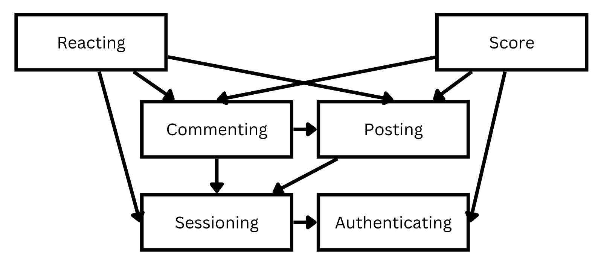

# Assignment 3 - Convergent Design

## Pitch

**Rely** is revolutionary social media platform that emphasizes reliability and misinformation prevention, allowing anyone to easily identify misinformation or fake content even when it is designed to look legitamite. This allows people who not tech-savvy enough to identify signs of misinformation to be able to easily spot when a piece of content is unreliable or fake. 

Every post and comment on Rely has a reliability score that allows users to easily identify if a piece of content is fake or not. Rely takes into consideration the sentiment of the reactions and comments from other users, the historial reliability of the user who posted the content, third-party fact-checking, and other factors in give a holistic and accurate reliability score for each post and comment.

Every user on Rely also has a reliability rating that is displayed on their profile, posts, and comments, allowing other users to easy spot historically untrustworthy sources. A user's reliability rating is calculated based on the reliability of their posts and comments, the reliability of users who interact with their content, historical content offenses, and other factors.

Rely's recommendation algorithm and personalized feeds also prioritize the reliability of content, ensure that misinformation and fake content is distributed less on the platform to prevent them from going viral, while also promoting and incentivizing the consistent creation of reliable content. Rely will foster a safe and trustworthy environment for users to share and consume content while also having the same social media experience they are used to, exploring entertaining content and connecting with others.

## Functional Design

### Concept 1: Authenticating

*\*Inspired by example given in The Essense of Software: Concept composition and sync.\**

#### Purpose

Authenticates users so that app users correspond to people.

#### Operational Principle

After a user registers with a username and password, they can authenticate as that user with the correct corresponding username and password pair.

#### State

registered: **set** User

username: registered -> **one** String

password: registered -> **one** String

#### Actions

register (n: String, p: String, **out** u: User)
```
u not in registered
registered += u
u.username := n
u.password := p
```

authenticate (n: String, p: String, **out** u: User)
```
for user in registered:
    if user.username == n and user.password == p:
        u := user
```

### Concept 2: Sessioning [User]

^ Not a intrinsic dependency

("User" is just a placeholder data type, where "User" here does not necessarily need to be related to the aforementioned Authentication concept. The Sessioning concept does not rely on any specfic properties of "User" and thus has no intrinsic dependencies on it.)

*\*Inspired by example given in The Essense of Software: Concept composition and sync.\**

#### Purpose

Allows users to stay authenticated for an extended period of time.

#### Operational Principle

After a session starts and before it ends, the getUser action returns the currently authenticated user that was identified at the start of the session.

#### State

active: **set** Session

user: active -> **one** User

#### Actions

start (u: User, **out** s: Session)
```
s not in active
active += s
s.user := u
```

getUser (s: Session, **out** u: User)
```
s in active
u := s.User
```

end (s: Session)
```
active -= s
```

### Concept 3: Posting [User, Content]

^ Not intrinsic dependencies

(Again, "User" and "Content" are just placeholder data types, where their properties are not relevant to the Posting concept.)

#### Purpose

Allows users to upload content.

While posting is a overall generic concept, Rely would use the average/historical reliability of posts to calculate a reliability score/rating for the user, allowing other users to see how reliable they are. However, this is only relevant during implementation, so the Posting concept is kept generic.

#### Operational Principle

A post containing content can be created associated with an user. A post can be deleted after it is created. getUserPosts returns all not-deleted posts associated with an user. getUser returns the user of a not-deleted post.

#### State

posts: **set** Post

user: posts -> **one** User

content: posts -> **one** Content

#### Actions

createPost (u: User, c: Content, i: int, **out** p: Post)
```
p not in posts
posts += p
p.user := u
p.content := c
```

getUser (p: Post, **out** u: User)
```
p in posts
u := p.user
```

getUserPosts (u: User, **out** ps: **set** Post)
```
for post in posts:
    if post.user == u:
        ps += post
```

deletePost (p: Post)
```
p in posts
posts -= p
```

### Concept 4: Commenting [User, Content, Item]

#### Purpose

Allows users to comment on items (a generic datatype).

While commenting is a overall generic concept, Rely would use sentiment analysis on comments (as well as considering how reliable the commenter is) to get the overall reliability score of a post, allowing other users to easily see how reliable a post is at a glance. However, this is only relevant during implementation, so the Commenting concept is kept generic.

#### Operational Principle

A comment containing content can be created associated with an user and referencing an item. A comment can be deleted after it is created. getItemComments returns all not-deleted comments that reference an item. getUserComments returns all not-deleted comments associated with an user.

#### State

comments: **set** Comment

user: comments -> **one** User

content: comments -> **one** Content

item: comments -> **one** Item

#### Actions

createComment (u: User, c: Content, i: Item, **out** cm: Comment)
```
cm not in comments
comments += cm
cm.user := u
cm.content := c
cm.item := i
```

getItemComments (i: Item, **out** cms: **set** Comment)
```
for comment in comments:
    if comment.item == i:
        cms += comment
```

getUserComments (u: User, **out** cms: **set** Comment)
```
for comment in comments:
    if comment.user == u:
        cms += comment
```

deleteComment (cm: Comment)
```
cm in comments
comments -= cm
```

### Concept 5: Score [Item]

*While this score is meant to be the reliability score/rating for posts, comments, and users, it is generalized to be a score for any item with no intrinsic dependencies.*

#### Purpose

Every item has a assotiated score.

Rely would associate each user/post/comment with a reliability score that would be calculated based on numerous factors, allowing users to notice at a glance if a user is historically unreliable or if a post/comment is unreliable. However, this is only relevant during implementation, so the Score concept is kept generic.

#### Operational Principle

A score can be created for an item with an associated value. A score can be deleted after it is created. The value of the score can be viewed or modified after the score is created and before it is deleted.

#### State

scores: **set** Score

item: scores -> **one** Item

value: scores -> **one** int

#### Actions

createScore (i: Item, v: int, **out** s: Score)
```
score.item != i for score in scores
s not in scores
scores += s
s.item := i
s.value := v
```

getScoreValue (s: Score, **out** v: int)
```
s in scores
v := s.value
```

updateScoreValue (s: Score, v: int)
```
s in scores
s.value := v
```

deleteScore (s: Score)
```
s in scores
scores -= s
```

### Concept 6: Reacting [User, Item]

#### Purpose

Allows users to react to items. 

While Reacting is a generic concept, Rely would use the sentiment of reactions (likes, dislikes, etc) to calculate the overall reliability score of a post or comment, allowing other users to easily see how reliable a post or comment is at a glance. The reactions on a user would also be used to determine their user reliability score. However, this is only relevant during implementation, so the Reacting concept is kept generic, where any user react in any way to any item.

#### Operational Principle

A reaction can be created associated with an user and an item. A reaction can be deleted after it is created. getUserReactions returns all not-deleted reactions associated with an user. getItemReactions returns all not-deleted reactions associated with an item. getUser returns the user of a not-deleted reaction.

#### State

reactions: **set** Reaction

user: reactions -> **one** User

item: reactions -> **one** Item

type: reactions -> **one** String

#### Actions

react (u: User, i: Item, t: String, **out** r: Reaction)
```
r not in reactions
reactions += r
r.user := u
r.item := i
r.type := t
```

getUserReactions (u: User, **out** rs: **set** Reaction)
```
for reaction in reactions:
    if reaction.user == u:
        rs += reaction
```

getItemReactions (i: Item, **out** rs: **set** Reaction)
```
for reaction in reactions:
    if reaction.item == i:
        rs += reaction
```

getUser (r: Reaction, **out** u: User)
```
r in reactions
u := r.user
```

deleteReaction (r: Reaction)
```
r in reactions
reactions -= r
```

### Syncronizations

Clarifications for syncronizations:

1. "Content" is a placeholder data type. Content data type may include text/images/videos but the specific properties of the data type is not important until implementation

2. DEFAULT_INITIAL_SCORE is a constant that represetns the initial reliability score/rating for users, posts, and comments when they are first created.

3. I have functions *calculateReliabilityScore(item: Item, **opt** posts: **set** Post, **opt** comments: **set** Comment, **out** reliabilityScoreValue: int)* that calculates the reliability score/rating for a user, post, or comment. The reliability score is calculated using a variety of variables (e.g. a user's reliability score depends on how reliable their posts are, a post's reliability score depends on the sentiment from it's comments and the reliability score of each commenter, etc) from various concepts. While the Score concept allows reliability scores to be displayed for users, posts, and comments, the *calculateReliabilityScore()* function is only used internally to generate these scores, and is not something the user will ever interact or see with directly. Thus, calculateReliabilityScore() would not be included as an action in the Score concept and would also not be it's own concept as it is more of an app-level feature where the exact score calculating formula is only relevant during implementation and does not interact directly with the users.

```
app Rely
    include Content
    include Authenticating
    include Sessioning[Authenticating.User]
    include Posting[Sessioning.Session, Content]
    include Commenting[Sessioning.Session, Content, Posting.Post], Commenting[Sessioning.Session, Content, Commenting.Comment]
    include Score[Posting.Post], Score[Commenting.Comment], Score[Authenticating.User]
    include Reacting[Sessioning.Session, Posting.Post], Reacting[Sessioning.Session, Commenting.Comment]

    sync register (username: String, password: String, **out** user: User, **out** userScore: Score):
        Authenticating.register(username, password, user)
        Score.createScore(user, DEFAULT_INITIAL_SCORE, userScore)

    sync login (username: String, password: String, **out** user: User, **out** session: Session):
        Authenticating.authenticate(username, password, user)
        Sessioning.start(user, session)

    sync authenticate (session: Session, **out** user: User):
        Sessioning.getUser(session, user)

    sync logout (session: Session):
        Sessioning.end(session)

    sync createPost (session: Session, content: Content, **out** user: User, **out** post: Post, **out** postScore: Score):
        when authenticate(session, user) // check if user is logged in
        Posting.createPost(user, content, post)
        Score.createScore(post, DEFAULT_INITIAL_SCORE, postScore)

    sync deletePost (session: Session, post: Post, **out** user: User):
        when authenticate(session, user) // check if user is logged in
        Posting.getUser(post, user)
        if user == post.user:
            Posting.deletePost(post)
            Score.deleteScore(post)
    
    sync createComment (session: Session, content: Content, item: Item, **out** user: User, **out** comment: Comment, **out** commentScore: Score):
        when authenticate(session, user) // check if user is logged in
        Commenting.createComment(user, content, item, comment)
        Score.createScore(comment, DEFAULT_INITIAL_SCORE, commentScore)
    
    sync deleteComment (session: Session, comment: Comment, **out** user: User):
        when authenticate(session, user) // check if user is logged in
        Commenting.getUser(comment, user)
        if user == comment.user:
            Commenting.deleteComment(comment)
            Score.deleteScore(comment)
    
    sync react (session: Session, item: Item, type: String, **out** user: User, **out** reaction: Reaction):
        when authenticate(session, user) // check if user is logged in
        Reacting.react(user, item, type, reaction)
    
    sync unReact (session: Session, reaction: Reaction, **out** user: User):
        when authenticate(session, user) // check if user is logged in
        Reacting.getUser(reaction, user)
        if user == reaction.user:
            Reacting.deleteReaction(reaction)
    
    // This function is run continuously in the background to update the reliability score of all users, since the user's reliability score might change due to events that may occur when they are not logged in.
    // Note that each user's reliability score depends on the reliability of their posts, comments, and reactions.
    sync updateUserScore (**out** posts: **set** Post, **out** comments: **set** Comment, **out** reactions: **set** Reaction, **out** reliabilityScoreValue: int, **out** userScore: Score):
        for user in Authenticating.registered:
            Posting.getUserPosts(user, posts)
            Commenting.getUserComments(user, comments)
            Reacting.getUserReactions(user, reactions)
            calculateReliabilityScore(user, posts, comments, reliabilityScoreValue) // black-box app-level algorithm that is only relevant during implementation and does not interact with the user
            Score.updateScoreValue(userScore, reliabilityScoreValue)
    
    // This function is run continuously in the background to update the reliability score of all posts and comments, since the post/comments's reliability score might change due to events that may occur when the corresponding is not logged in.
    // Note that each post's score depends on its comments and reactions. Each comment's score also depends on it's nested comments and reactions.
    sync updateItemScore (**out** comments: **set** Comment, **out** reactions: **set** Reaction, **out** reliabilityScoreValue: int, **out** itemScore: Score):
        // Update reliability score of all posts and comments
        for item in Posting.posts + Commenting.comments:
            getItemComments(item, comments)
            getItemReactions(item, reactions)
            calculateReliabilityScore(item, comments, reliabilityScoreValue) // black-box app-level algorithm that is only relevant during implementation and does not interact with the user
            Score.updateScoreValue(itemScore, reliabilityScoreValue)

```

### Dependency Diagram



## Wireframes

The wireframes display all core concepts and actions of the app. For the sake of simplicity, however, redundant functionalities may not always be shown in the wireframes for every user, post, or comment. 

For example, in the wireframes, you are only able to view the profile of certain (but not all) users, since creating a seperate wireframe for every user's profile would be redundant (during implementation of the actual app, you will be able to access the profile of any user). Additionally, nested comments (comments of another comment) are also shown in the wireframes, as it would be basically the same as viewing the comments of a post. You can also only rate some posts, as rating every single post and comment would be redundant (but in the actual app, you would be able to rate every post and comment).

Figma Prototype:  
https://www.figma.com/proto/RN7SCh2CE93nKFctAg5EAr/A3-Wireframe%3A-Rely?node-id=11-143&t=mlBXDV0pkN6CIL9B-1

Figma Dev Link:  
https://www.figma.com/design/RN7SCh2CE93nKFctAg5EAr/A3-Wireframe%3A-Rely?node-id=1-59&m=dev&t=nnDWq2TegxYW7Ki5-1

## Design Tradeoffs

### 1. Likes & Disliks vs. Rating 0-100

One design choice I had to make was how a user can react to a post or comment. I initially wanted to allow users to rate each post and comment from 0-100. This allows users to accurately rate how reliable a piece of content is, but it is less intuitive and easy for users. Thus, I decided to go with likes and dislikes, as it is more user-friendly and easier to understand, while still providing a good amount of nuance when it comes to rating content. Existing platforms like Twitter and Instagram do not have a dislike button, and Reddit has a net upvote/downvote system. Thus, Rely's display of total likes and dislikes would still provide information that other platforms might not provide (since YouTube removed dislike counts). This would also be easy to change into a rating 0-100 system, since the "type" attribute of the Reaction concept can be easily modified to include a rating.

### 2. Reliability Score Calculation

I had to decide whether to include reliability score calculations as a concept or as an app-level feature. I decided to include it as an app-level feature, since the exact formula for calculating the reliability score is only relevant during implementation. The user only sees the scores of each post, comment, and user, but they do not need to see the calculations behind it. Thus, the *calculateReliabilityScore()* function will not be it's own concept since it fits better as an app-level feature. The Score conept serves to store the reliability score of each post, comment, and user, while the *calculateReliabilityScore()* function is used internally to generate these scores.

### 3. Keeping Reactions/Comments when it's parent item is deleted

If the reactions and comments of an item are deleted when the item is deleted, it would be easier to manage the database and prevent orphaned data. However, this would also remove valuable data that could be used to calculate the reliability score of other items, and could also be abused by users to censor other people's reactions/comments or to manipulate other users' reliability scores by deleting their reactions/comments. Thus, while the implementation would have to take into account orphaned data, it would be better to keep the reactions and comments of an item even after it is deleted.