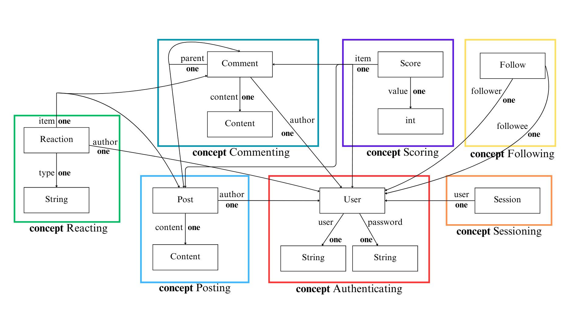

# Assignment 4 (Alpha) - Backend Design & Implementation

## Important Links

### Backend Code Repository

https://github.com/earlight/61040-backend

### Deployed Service on Vercel (Alpha Deployment)

https://61040-backend-jpceawzis-richard-lins-projects-1fac4921.vercel.app/

## Fully Implemented Concepts

In addition to the four default concepts, I fully implemented the Commenting and Reacting concepts:

https://github.com/earlight/61040-backend/blob/945ae4f665b49a75568bdf132ffa8aa393918627/server/concepts/commenting.ts

https://github.com/earlight/61040-backend/blob/945ae4f665b49a75568bdf132ffa8aa393918627/server/concepts/reacting.ts

*I also implmented these concepts accordingly in app.ts, response.ts, routes.ts, and util.ts.*

The design of the RESTful routes for the remaining concepts (Following, Scoring) are also outlined:

https://github.com/earlight/61040-backend/blob/945ae4f665b49a75568bdf132ffa8aa393918627/server/routes.ts#L238

## Abstract Data Models

Most of the concepts are the same from Assignment 3, with minor refinements/improvements for clarity.

The full concept definitions from Assignment 3 can be found here:  
https://earlight.github.io/portfolio-rlin/assignments/assignment3.html#functional-design-concepts

### Concept 1: Authenticating

#### State

username: User -> **one** String

password: User -> **one** String

### Concept 2: Sessioning [User]

#### State

user: Session -> **one** User

### Concept 3: Posting [User]

#### State

author: Post -> **one** User

content: Post -> **one** Content

### Concept 4: Commenting [User, Parent]

#### State

author: Comment -> **one** User

content: Comment -> **one** Content

parent: Comment -> **one** Parent

### Concept 5: Scoring [Item]

#### State

item: Score -> **one** Item

value: Score -> **one** int

### Concept 6: Reacting [User, Item]

#### State

author: Reaction -> **one** User

item: Reaction -> **one** Item

type: Reaction -> **one** String

### Concept 7: Following [User]

#### State

follower: Follow -> **one** User

followee: Follow -> **one** User

### Data Model Diagram

