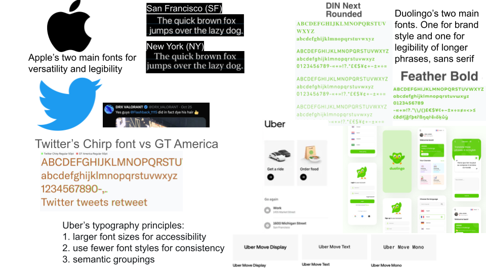
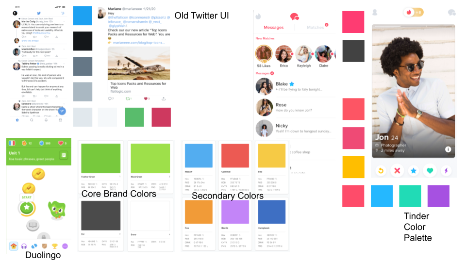

# Assignment 5 (Beta) - Frontend Design & Implementation

## Important Links

### Frontend Code Repository

https://github.com/earlight/61040-frontend

### Deployed Service on Vercel

https://61040-frontend-mu.vercel.app

### Wireframes (from Assignment 3)

Figma Prototype:  
https://www.figma.com/proto/RN7SCh2CE93nKFctAg5EAr/A3-Wireframe%3A-Rely?node-id=11-143&t=mlBXDV0pkN6CIL9B-1

Figma Dev Link:  
https://www.figma.com/design/RN7SCh2CE93nKFctAg5EAr/A3-Wireframe%3A-Rely?node-id=1-59&m=dev&t=nnDWq2TegxYW7Ki5-1

## Heuristic Evaluation

### Usability Criteria

#### 1. Discoverability

One on hand, the wireframes for Rely portray a relatively standard and intuitive user interface with all the standard features of a social media app, allowing users to find familiarity and similarities from using Instgram, Twitter, Reddit, etc. However, I need to make sure the design of the Rely app does not make users feel overly familiar and bored, since I need to create the impression that Rely allows for a different and unique experience compared to other social media apps. Specifically, the discoverability of my wireframes could be improve to further emphasize the "reliability" and  "anti-misinformation" features of Rely, which are the unique selling points of the app.

#### 2. Pleasantness

My wireframes currently display a bright green color for reliable posts/users, and a bright red color for unreliable posts/users. While this bright green and red color scheme is eye-catching and easy to understand, it may be too harsh or unpleasant for some users, where a more subtle color scheme may increase the pleasantness of the app. I could always have a "saturated" option to increase the saturation of the reliability scores in my app. Another tradeoff between pleasantness and discoverability is that that having just the scores themselves be colored may not be enough to make the reliability scores stand out, so I may need to add more visual elements to make the reliability scores more noticeable (i.e. make the entire post's background green or red to indicate reliability), but I need to be careful not to overly discard discoverability and intuitive-ness for the sake of pleasantness.

### Physical Heuristics

#### 1. Fitt's Law

I prioritize the Fitt's law in the wirefreames by:
1. Making all the elements in the side bar relatively close to each other.
2. Making the like, dislike, and comment buttons relatively large and close together so that performing operations on posts is easy and quick.

However, I need to make sure that the elements are not too close together, as this may make the app feel cluttered and difficult to navigate.

#### 2. Situational Context

When looking at a user's profile, the user's name, icon, and reliability score are stickied to the top of the page to provide context that we are in a profile page. When looking at a post's comments, the post and the "Add Comment" text box/button are also stickied to the top of the page to provide context that we are in a comments page. This situational context helps users understand where they are in the app and what they are looking at. One thing I could improve on is to add a "Home" indicator to the top of the page to allow users know that they are on the home page, which could improve situational context, especially when I start to add more feeds such as "Following" and "Discover".

### Linguistic Level

#### 1. Speak A User's Language

I believe that my wireframes could use some work in this area. While each post has two boxes with text saying "User Reliability Score: xx" and a "Post Reliability Score: xx", I could improve the language of these boxes to make them more user-friendly and less technical. There is a tradeoff between using technical language to make the app feel more professional and using user-friendly language to make the app more accessible to a wider audience. I need to find a balance between displaying correct information to differentiate between user and post reliability scores and using language that is easy to understand for all users.

#### 2. Consistency

Once again, there might be a tradeoff between consistency and discoverability of the Rely app. The "User Reliability Score: xx" and a "Post Reliability Score: xx" boxes are consistent in their language and visuals, but being too similar might make the users think that they are the same thing. I need to make sure that the user and post reliability scores are visually distinct from each other, while still being consistent in their language and placement.

## Visual Design Study

### Typography

### Color

