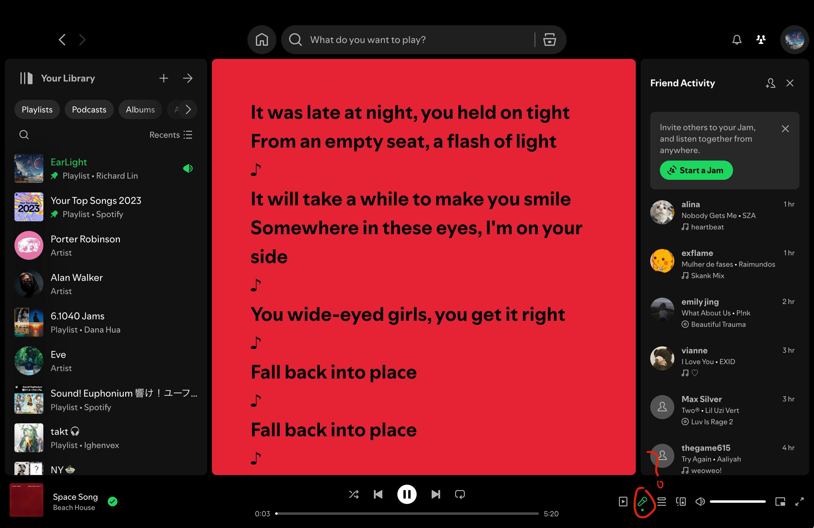
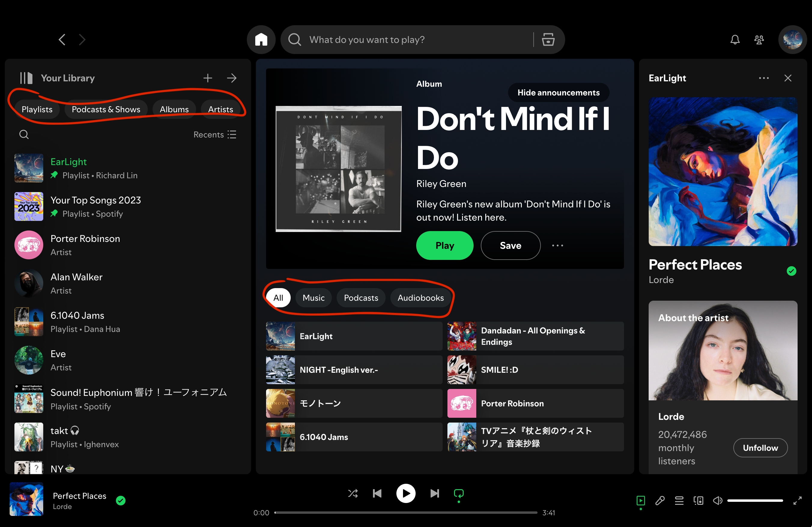
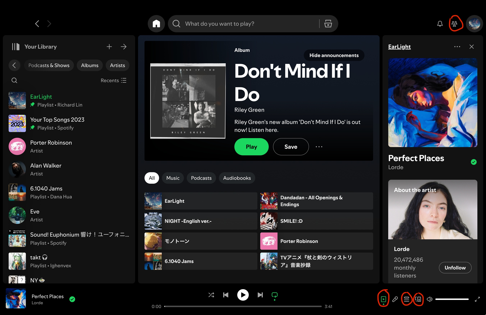

# Lecture 12 Blog - Visual Design

## The Flaws in Spotify's Visual Design

Lecture 12 highlighted the many simply and subtle visual design methods that differentiates a good visual design from a bad one. This reminded me of Spotify's visual design, which I believe has gotten consistently worse over the years as they added more concepts and clutter to their UI, prioritizing new features over the user experience and visual design.

### Layout

Looking at Spotify's current UI (below), we can notice an immediete problem with the layout of the page: the recommended album is absurdly large, taking up nearly half of the center page with just one album. This generous use of space is in steep contrast to the rest of the UI, which has songs and playlists put much closer together. This inconsistency in visual design feels jarring and makes me think that spotify just cares about promoting the album, rather than the user experience.

### Poor Use of Color

The background of the lyrics page seems to be based on the most used color of the album cover, and the colors are always very bright. While I'm sure the bright colors are to make the black lyrics easier to read, you can see below that the bright red background (below) of the lyrics page is extremly visually displeasing and jarring compared to the dark color scheme of the rest of the UI.

P.S. Turn on dark mode for this blog (top right) to more clearly see the effect of the poor color choice of the lyrics page background.

### Clutter and Redundancy

Looking at the home page (below), a new user may initially be overwelmed. Theres a a libarary tab on the right that allows you to see your playlists, podcasts, albums, and artists. There is also a home page where you can sort by music, playlist, and audiobooks, but it is not clear how the home page and the library tab on the left are different, other than the options you can filter by.  

### Inconsistencies and Unintuitive Design

The right-side tab can switch between your friend list, the information on the current song, the queue, and a tab to connect to other devices. Why can you only view one of these at the same time? What if you wanted to queue your friends activity and the current song queue at the same time? Why is the friends button all the way at the top of the screen when all the other "ride-side tab features" are at the bottom?

The lyrics button also feels out of place, since clicking on it opens the lyrics in the center of the page instead of the right-side tab, even tho the lyrics button is in of a row of buttons that all otherwise open something in the right-side tab.

### Conclusion

While these are just specific examples, you can start to notice a trend where Spotify's UI is cluttered and (in my subjective opinion) not as intuitive as it could be. Certain features can't be used at the same time since they take up the same part of the screen (the left-side tab, center page, and right-side tab). There are also inconsistencies in the design littered throughout the UI, as well as poor design choices when it comes to color and proportions. It feels like in an attempt to include all these new fetures, Spotify has made the UI more complicated and less intuitive, as well as less visually appealing.