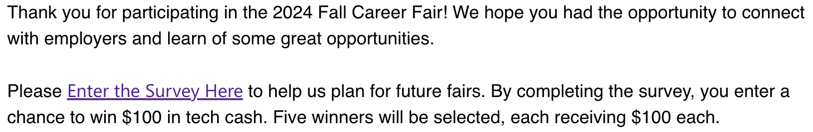
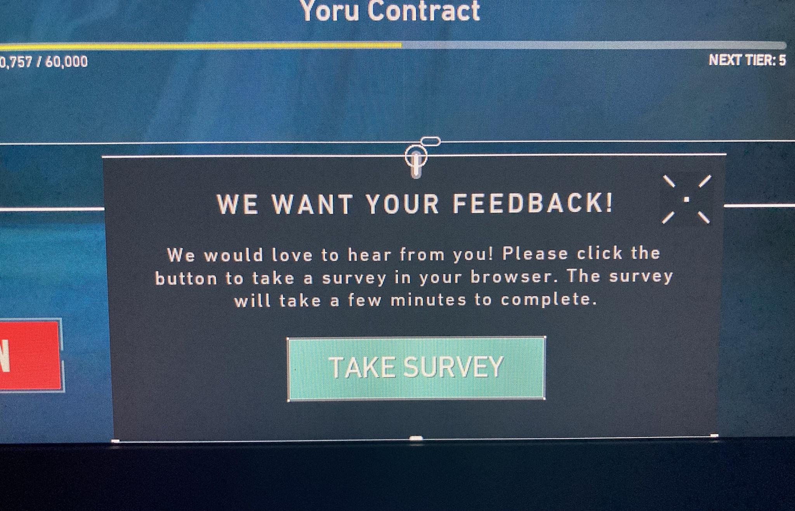

# Lecture 13 Blog - User Testing

## Making Surveys More Appealing

One of the main user testing methods mentioned in today's lecture was surveys. One of the largest benefits of surveys as a method of user testing is that it is relatively easy to set up and distribute. However, while I know people who are eager to take surveys and express their opinons, I also know a lot of people who may not go out of their way to fill surveys. When I receive surveys in my email, perhaps from a service that I recently used, I often ignore them or delete them. I believe that one of the biggest challenges for surveys is how to incentivize people to take them, or at the very least, make them more appealing to users who would otherwise ignore them and go about their day.

Of course, this would mean that survey providers are incentivized the make their survey appealing and increase the likelihood that people would click on their surveys. This could be done by providing some sort of monetary incentive, such as the MIT surveys that give you a chance to win tech cash:

In lecture, it was mentioned Twitter makes their surveys more appealing by using the wording "we've selected a group of users for a brief survey" to make the survey seem more exclusive and personal to the user. Another similar example that comes to mind is the video game Valorant (below), where the option to take a user feedback survey is presented as a rare and exclusive in-game event with a low chance of ever happening. In my 1000+ hours playing Valorant, I have only gotten the option to take their user feedback survey twice:

Rewards, monetary incentives, and exclusivity are just some of many ways surveys are designed to be more appealing to users. On a tangent, I find it funny that large survey services like Qualtrics and SurveyMonkey likely have entire teams of engineers dedicated to optimizing the user experience of their surveys. They likely use other user testing methods mentioned in lecture such as A/B testing and user studies (or perhaps even surveys that ask for feedback on their surveys) to improve their surveys and maximize the click-through rates/completion rates.